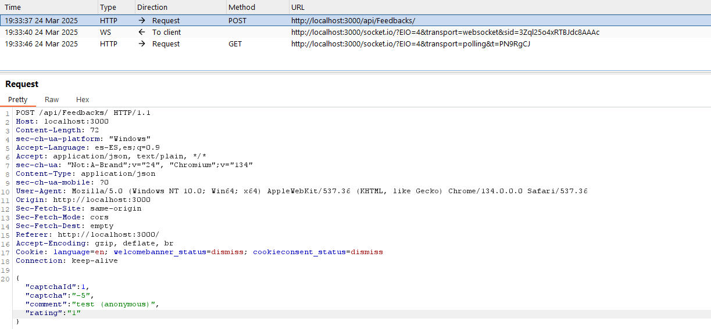
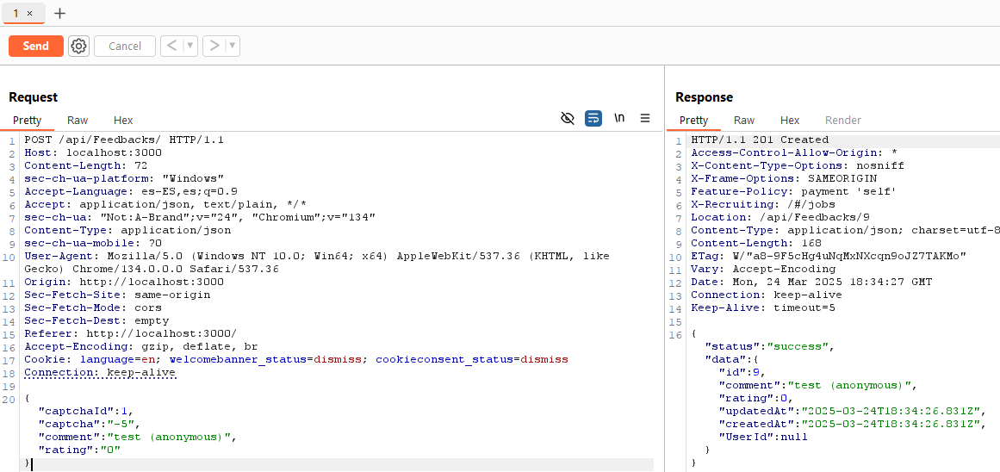

# Zero Stars - Improper Input Validation

**Objetivo:** Enviar una reseña de 0 estrellas en la sección de feedback de **OWASP Juice Shop**, sorteando la validación del cliente (*frontend*).

---

El ejercicio nos indica que debemos enviar una reseña con **0 estrellas**, algo que normalmente no está permitido desde el frontend. Por lo tanto, debemos encontrar la sección de la web donde se gestionan los *feedbacks* y manipular la petición que se envía al servidor.

---

## 1. Acceder a la sección de Feedbacks

Abrimos el menú de navegación de la aplicación y buscamos la sección llamada **"Feedbacks"**. Aquí se nos presenta un formulario donde podemos introducir un comentario y seleccionar una valoración en forma de estrellas.


---

## 2. Interceptar la petición con Burp Suite

Antes de enviar el formulario, activamos **Burp Suite** en modo *Intercept* para capturar la solicitud HTTP que se genera al hacer clic en el botón **Submit**.

Una vez enviada, capturamos una **petición POST** que contiene los datos del formulario. Confirmamos que es la petición correcta revisando los campos en el cuerpo del mensaje, como `comment` y especialmente `rating`.



---

## 3. Enviar la petición modificada desde Repeater

Con la petición seleccionada, hacemos clic derecho y la enviamos al **Repeater** de Burp Suite. Aquí podremos modificar los datos manualmente y reenviar la solicitud tantas veces como queramos.

Editamos el campo `rating` y lo modificamos a:

```json
{
  "captchaId": 1,
  "captcha": "-5",
  "comment": "test (anonymous)",
  "rating": "0"
}
```

Esto nos permite eludir la validación del frontend ya que estamos manipulando los datos despues de haber pasado todos los controles de los datos en el formulario.


---

## 4. Verificar la respuesta del servidor

Al hacer clic en **Send**, recibimos una respuesta que contiene:




Esto confirma que el servidor ha aceptado la reseña con **0 estrellas**, lo cual demuestra que **no existe validación del lado del servidor**.


---

## 🛡️ ¿Como securizarlo?

Este fallo ocurre porque el servidor **no valida correctamente el valor del campo `rating`**, permitiendo que se envíen datos manipulados desde el cliente (como `rating=0`) y los procese como válidos.

Aunque el formulario del frontend (Angular) limite la selección de estrellas, **el backend en Node.js (Express) debería validar todos los datos antes de procesarlos**.

En este caso, se recomienda implementar una validación en el backend que asegure que el valor de `rating` esté dentro del rango permitido (por ejemplo, entre 1 y 5).&#x20;
